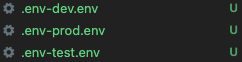

# dev prod test 環境配置

## 安裝相關的 Plugin

`yarn add env-cmd`

## HELP Usage

```shell
Options:
  -v, --version                       output the version number
  -e, --environments [env1,env2,...]  The rc file environment(s) to use
  -f, --file [path]                   Custom env file path (default path: ./.env)
  --fallback                          Fallback to default env file path, if custom env file path not found
  --no-override                       Do not override existing environment variables
  -r, --rc-file [path]                Custom rc file path (default path: ./.env-cmdrc(|.js|.json)
  --silent                            Ignore any env-cmd errors and only fail on executed program failure.
  --use-shell                         Execute the command in a new shell with the given environment
  --verbose                           Print helpful debugging information
  -x, --expand-envs                   Replace $var in args and command with environment variables
  -h, --help                          output usage information 

```

## package.json 相關配置

```shell
env-file
├─.env-dev.env # dev env 檔
├─.env-prod.env # dev env 檔
├─.env-test.env # dev env 檔
├─index.js  #入口
├─package.json
└yarn.lock
```

## 建立好相關的檔案 dev 檔及內容



```shell
TEST_NAME=Default File Path prod
NODE_ENV=prod
ENVVAR=exists
ENV_PATH=./.env-prod.env
```

## 執行情況

```shell
hudoudou@hudoudoudeMacBook-Pro env-file % yarn prod
 #當執行後將會自動在package.json 運行script相關的命令行
yarn run v1.22.15
warning package.json: No license field
warning ../../../../../package.json: No license field
$ env-cmd --verbose -f .env-prod.env node index.js #<-----這裏運行
Options: {"command":"node","commandArgs":["index.js"],"envFile":{"filePath":".env-prod.env"},"options":{"expandEnvs":false,"noOverride":false,"silent":false,"useShell":false,"verbose":true}}
Found .env file at path: .env-prod.env
[
  '/Users/hudoudou/.nvm/versions/node/v16.15.0/bin/node',
  '/Users/hudoudou/Desktop/recode/ENVCMD/env-cmd-examples/examples/env-file/index.js'
]
#這裏是我在Index.js 運行log的情況
Environment---> prod  #對應dev內容輸出
ENVVAR---> exists #對應dev內容輸出
ENV_PATH---> ./.env-prod.env #對應dev內容輸出
Child process exited with code: 0 and signal:. Terminating parent process...
✨  Done in 0.12s.
```
